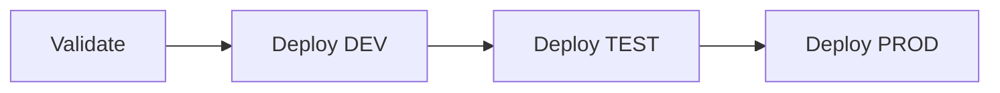

# CI/CD para Copilot Studio Agent

Este proyecto incluye pipelines de CI/CD automatizados para desplegar el agente de Copilot Studio a múltiples ambientes.

## 🚀 Pipeline de Deployment

El pipeline automático (`deploy-copilot-agent.yml`) se ejecuta en estos escenarios:

### 📌 Triggers

1. **Push a main** - Despliega automáticamente a DEV → TEST → PROD
2. **Pull Request** - Valida la solución sin desplegar
3. **Manual** - Permite seleccionar el ambiente de destino

### 🔄 Stages



#### 1️⃣ Validate
- ✅ Empaqueta la solución desde `solution/`
- ✅ Ejecuta validación con `pac solution check`
- ✅ Guarda resultados de validación como artifact
- ✅ Sube paquete para deployment

#### 2️⃣ Deploy DEV
- 🚀 Importa solución a ambiente de desarrollo
- 🤖 Publica el agente automáticamente
- ⏱️ Se ejecuta solo en push a `main`

#### 3️⃣ Deploy TEST
- 🧪 Importa solución a ambiente de pruebas
- 🤖 Publica el agente
- ⏱️ Requiere aprobación manual (GitHub Environment)

#### 4️⃣ Deploy PROD
- 🏭 Importa solución a producción
- 🤖 Publica el agente
- 📢 Crea un GitHub Release automáticamente
- ⏱️ Requiere aprobación manual

## ⚙️ Configuración Inicial

### 1. Crear Service Principal en Azure AD

```powershell
# Ejecutar en PowerShell
.\scripts\crear-service-principal.ps1
```

O manualmente:

```bash
az ad app create --display-name "GitHub-CopilotStudio-CICD"
az ad sp create --id <APP_ID>
az ad app credential reset --id <APP_ID> --append
```

### 2. Asignar permisos en Power Platform

1. Ve a [Power Platform Admin Center](https://admin.powerplatform.microsoft.com)
2. Para cada ambiente (DEV, TEST, PROD):
   - Settings → Users + permissions → Application users
   - New app user → Select app (GitHub-CopilotStudio-CICD)
   - Business unit → (seleccionar)
   - Security roles → **System Administrator**

### 3. Configurar GitHub Secrets

En tu repositorio: **Settings** → **Secrets and variables** → **Actions** → **New repository secret**

Agrega estos secrets:

```bash
# Azure AD / Entra ID
POWER_PLATFORM_TENANT_ID=tu-tenant-id
POWER_PLATFORM_APP_ID=tu-app-id
POWER_PLATFORM_CLIENT_SECRET=tu-client-secret

# Ambientes (URLs completas)
POWER_PLATFORM_URL_DEV=https://org-dev.crm.dynamics.com/
POWER_PLATFORM_URL_TEST=https://org-test.crm.dynamics.com/
POWER_PLATFORM_URL_PROD=https://org-prod.crm.dynamics.com/

# Para ambientes específicos (Environment IDs)
POWER_PLATFORM_ENV_DEV=environment-id-dev
POWER_PLATFORM_ENV_TEST=environment-id-test
POWER_PLATFORM_ENV_PROD=environment-id-prod
```

### 4. Configurar GitHub Environments

1. Ve a **Settings** → **Environments**
2. Crea estos ambientes:
   - `development` (sin protección)
   - `test` (requiere 1 revisor)
   - `production` (requiere 2 revisores + espera 5 min)

Para cada ambiente, agrega las **environment protection rules**:

- ✅ Required reviewers (1-2 personas)
- ✅ Wait timer (5-10 minutos para prod)
- ✅ Deployment branches (solo `main`)

## 🔧 Scripts de Ayuda

### Crear Service Principal

```powershell
.\scripts\crear-service-principal.ps1
```

Este script:
- Crea la aplicación en Azure AD
- Genera el secret
- Muestra los valores para los GitHub Secrets

### Verificar Configuración

```powershell
.\scripts\verificar-cicd.ps1
```

Este script verifica:
- ✅ Service Principal existe
- ✅ Tiene permisos en todos los ambientes
- ✅ GitHub Secrets están configurados
- ✅ Pipeline está activo

## 📋 Workflow Manual

Para ejecutar un deployment manual:

1. Ve a **Actions** → **CI/CD - Deploy Copilot Agent**
2. Click en **Run workflow**
3. Selecciona el ambiente (dev/test/prod)
4. Click en **Run workflow**

## 🧪 Testing del Pipeline

### Test Local

```powershell
# Simular el empaquetado
pac solution pack --folder solution --zipfile MyRetailAgent.zip

# Simular la validación
pac solution check --path MyRetailAgent.zip --outputDirectory validation-results
```

### Test en PR

1. Crea una branch: `git checkout -b feature/test-cicd`
2. Haz un cambio en `solution/`
3. Commit y push
4. Crea un Pull Request
5. El pipeline validará automáticamente

## 📊 Monitoreo

### Ver el estado del pipeline

1. Ve a la pestaña **Actions** en GitHub
2. Selecciona el workflow **CI/CD - Deploy Copilot Agent**
3. Click en el run más reciente

### Logs detallados

Cada step del pipeline genera logs detallados:
- 📥 Checkout código
- 🔐 Autenticación
- 📦 Empaquetado
- ✅ Validación
- 🚀 Deployment
- 🤖 Publicación del agente

## 🔐 Seguridad

### Secrets Management

- ❌ **NUNCA** comitees secrets en el código
- ✅ Usa GitHub Secrets para credenciales
- ✅ Rota los secrets cada 90 días
- ✅ Usa diferentes service principals por ambiente

### Permisos Mínimos

El Service Principal debe tener **solo** estos permisos:
- System Administrator en cada ambiente
- Dynamics 365 Import/Export

### Aprobaciones

- **DEV**: Sin aprobación (auto-deploy)
- **TEST**: 1 revisor
- **PROD**: 2 revisores + wait timer

## 🚨 Troubleshooting

### Error: "Authentication failed"

```powershell
# Verificar que el secret es válido
az login --service-principal `
  --username $env:POWER_PLATFORM_APP_ID `
  --password $env:POWER_PLATFORM_CLIENT_SECRET `
  --tenant $env:POWER_PLATFORM_TENANT_ID
```

### Error: "Solution import failed"

1. Revisa los logs en GitHub Actions
2. Valida localmente:
   ```powershell
   pac solution check --path MyRetailAgent.zip
   ```
3. Verifica dependencias de la solución

### Error: "Agent not found"

El agente debe existir en el ambiente de destino. Si es la primera vez:

```powershell
# Crear el agente desde template
pac copilot create `
  --name "miemp_asistenteRetailConFlow" `
  --description "Asistente de Retail con Cloud Flows" `
  --template-file templates/retail-agent-template.yaml
```

## 📈 Mejoras Futuras

- [ ] Tests automatizados del agente
- [ ] Rollback automático en caso de fallo
- [ ] Notificaciones a Teams/Slack
- [ ] Métricas de uso post-deployment
- [ ] Integración con Azure DevOps Boards

## 📚 Referencias

- [Power Platform Actions](https://github.com/microsoft/powerplatform-actions)
- [GitHub Actions Docs](https://docs.github.com/actions)
- [Power Platform CLI](https://learn.microsoft.com/power-platform/developer/cli/introduction)
